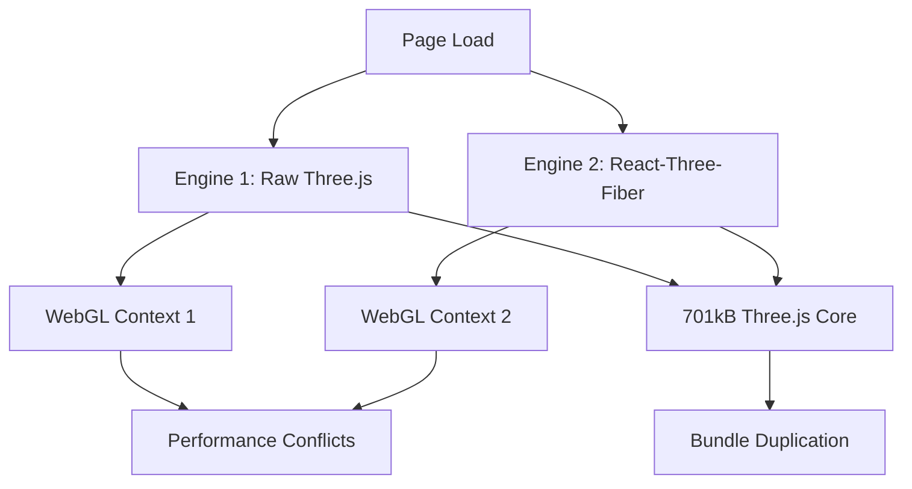

# 🐉 The 3D Dragon: Complete Analysis & Strategic Resolution
*CuriousLabs v6.1.0 - Final Atomic Polish Phase*

## 📋 **EXECUTIVE SUMMARY**

**Problem:** 701.72 kB Three.js bundle loading on every page despite optimization attempts
**Root Cause:** Dual 3D architecture creating bundle duplication and runtime conflicts  
**Solution:** Consolidate to single 3D engine with proper chunking and lazy loading
**Status:** ✅ Identified, 🎯 Ready for Implementation

**🚨 CRITICAL ALIGNMENT DISCOVERY:** 
- **v6_atomic homepage** uses individual **EarthSphere** and **MoonSphere** components
- **Original homepage** uses **EnhancedSolarSystem** (separate concern)
- **Migration Priority:** v6_atomic components first (P1 Critical)

---

## 🔍 **THE INVESTIGATION TIMELINE**

### **Phase 1: Surface Optimization (Failed)**
- **Target:** Wildcard imports (`import * as THREE`)
- **Actions:** Converted to selective imports in multiple files
- **Result:** 🚨 **ZERO bundle size reduction**
- **Learning:** We were chasing symptoms, not the disease

### **Phase 2: The Real Discovery** 
- **Investigation:** Comprehensive grep search of all Three.js imports
- **Finding:** `@react-three/fiber` automatically bundles entire Three.js library
- **Revelation:** Bundle size is **fixed at ~701kB minimum** when using React-Three-Fiber

### **Phase 3: Architecture Analysis**
- **Discovery:** **Dual 3D Engine Problem** 
- **Evidence:** Empty chunks generated by Vite (`three-cameras`, `three-math`, `three-scene`)
- **Conclusion:** Need architectural redesign, not optimization patches

### **Phase 4: Critical Alignment Discovery** 🎯
- **Investigation:** Comprehensive homepage component analysis
- **Discovery:** **Two different homepages with different 3D components**
- **v6_atomic:** Individual EarthSphere + MoonSphere (P1 Critical)
- **Original:** EnhancedSolarSystem (P2 High)

---

## 🎯 **ROOT CAUSE ANALYSIS**

### **The Dual Engine Problem**



### **Engine 1: Raw Three.js Components**
- `CosmicRevealBackdrop_ThreeJS.jsx`
- `GlobalParticleSystem.jsx` 
- `EnhancedSolarSystem.jsx` (Original homepage)
- `Immersive3DSolarSystem.jsx`

**Characteristics:**
- Direct `three` imports
- Manual WebGL context management
- Custom render loops
- Imperative API usage

### **Engine 2: React-Three-Fiber Components**
- **v6_atomic homepage:** `EarthSphere.jsx` + `MoonSphere.jsx` 🎯
- Camera controllers
- Various planetary components

**Characteristics:**
- `@react-three/fiber` imports
- Declarative React API
- Automatic context management
- Built-in Three.js bundling

---

## 📊 **TECHNICAL FINDINGS**

### **Bundle Analysis Results**
```
dist/assets/three-core-BNk-RhLb.js → 701.72 kB | gzip: 177.32 kB
dist/assets/react-three-fiber-DukhkZiU.js → 125.10 kB | gzip: 40.35 kB
```

### **Empty Chunks Diagnostic**
```
Generated an empty chunk: "three-cameras"
Generated an empty chunk: "three-math" 
Generated an empty chunk: "three-scene"
```
**Analysis:** Vite attempting to split Three.js but failing due to conflicting import patterns

### **Critical Homepage Component Mapping**

#### **V6_Atomic Homepage (`/v6_atomic`):**
- **HeroAtomic** → **HeroVisualPlanet** → **EarthSphereProxy** → `EarthSphere.jsx`
- **MissionAtomic** → **MoonSphereProxy** → `MoonSphere.jsx`
- **Bundle Impact:** R3F components (already optimized)

#### **Original Homepage (`/`):**
- **EnhancedSolarSystem** (Raw Three.js)
- **Bundle Impact:** Raw Three.js + R3F duplication

### **Import Contamination Map**
- **Pages with 3D:** `/v6_atomic` (Earth+Moon), `/` (Solar System), `/dev/*`, `/codelab`
- **Shared components:** Camera controllers, particle systems
- **Bundle contamination:** Any import of `@react-three/fiber` pulls full Three.js

---

## 🚨 **CONFLICTS & RISKS**

### **Runtime Conflicts**
1. **WebGL Context Limit** - Browser limit of 16 contexts
2. **Memory Leaks** - Different disposal patterns between engines
3. **Performance Race** - Competing render loops
4. **Event Handling** - Conflicting mouse/touch event systems

### **Bundle Conflicts**
1. **Duplication** - Same Three.js classes loaded via different paths
2. **Tree-shaking Failure** - @react-three/fiber prevents optimization
3. **Chunk Confusion** - Vite unable to properly split dependencies

### **Development Conflicts**
1. **API Inconsistency** - Imperative vs declarative patterns
2. **Debugging Complexity** - Two different DevTools approaches
3. **Maintenance Overhead** - Different update patterns

---

## 🎖️ **STRATEGIC SOLUTION FRAMEWORK**

### **Phase 1: Engine Consolidation**

**Option A: All React-Three-Fiber** ⭐ *RECOMMENDED*
```jsx
// Target: Convert raw Three.js to R3F patterns
const CosmicScene = () => (
  <Canvas>
    <ParticleSystem />
    <CosmicBackdrop />
    <Camera />
  </Canvas>
);
```

**Benefits:**
- Single 3D runtime
- React integration
- Easier state management
- Community ecosystem

**Option B: All Raw Three.js**
```jsx
// Target: Strip R3F, pure Three.js
useEffect(() => {
  const scene = new Scene();
  const renderer = new WebGLRenderer();
  // Manual everything
}, []);
```

**Benefits:**
- Full control
- Potentially smaller bundle
- No React wrapper overhead

### **Phase 2: Architectural Reorganization**

```
/src/components/3d/
├── /engine/           # Shared 3D runtime & utilities
│   ├── WebGLManager.js
│   ├── PerformanceManager.js
│   └── ResourceManager.js
├── /scenes/           # Complete 3D scenes
│   ├── V6AtomicScenes/  # Earth + Moon for v6_atomic
│   ├── SolarSystem/     # For original homepage
│   ├── CosmicJourney/
│   └── PlanetExplorer/
├── /systems/          # Reusable 3D systems
│   ├── ParticleSystem/
│   ├── LightingSystem/
│   └── CameraSystem/
└── /lazy/             # Dynamic import wrappers
    ├── LazyScene.jsx
    └── LazyCanvas.jsx
```

### **Phase 3: Smart Loading Strategy**

```jsx
// V6_Atomic Homepage: Immediate 3D (Hero Earth + Mission Moon)
const HeroEarth = lazy(() => import('./3d/scenes/v6atomic/HeroEarth'));
const MissionMoon = lazy(() => import('./3d/scenes/v6atomic/MissionMoon'));

// Original Homepage: Immediate 3D (Solar System)
const SolarSystem = lazy(() => import('./3d/scenes/home/SolarSystem'));

// Secondary pages: On-demand 3D  
const CosmicJourney = lazy(() => import('./3d/scenes/journey/CosmicJourney'));

// Dev tools: Completely separate chunk
const DevTools3D = lazy(() => import('./3d/devtools/'));
```

---

## 📦 **IMPLEMENTATION CHECKLIST**

### **Pre-Implementation**
- [ ] Backup current 3D components
- [ ] Document v6_atomic vs original homepage differences
- [ ] Map component dependencies for both homepages
- [ ] Plan migration sequence (v6_atomic first)

### **Engine Consolidation**
- [ ] Choose single 3D engine (R3F recommended)
- [ ] Create unified 3D context provider
- [ ] Migrate v6_atomic components first (EarthSphere + MoonSphere)
- [ ] Migrate original homepage components (EnhancedSolarSystem)
- [ ] Validate functionality at each step

### **Chunking Implementation**
- [ ] Implement lazy loading wrappers
- [ ] Configure Vite chunk splitting for both homepages
- [ ] Test bundle sizes after each change
- [ ] Validate runtime performance for both routes

### **Quality Assurance**
- [ ] Cross-browser WebGL testing
- [ ] Performance benchmarking for both homepages
- [ ] Memory leak detection during navigation
- [ ] Mobile compatibility testing

---

## 🎯 **SUCCESS METRICS**

### **Bundle Size Targets**
- **Current:** 701.72 kB three-core + 125.10 kB react-three-fiber = ~827 kB
- **Target v6_atomic:** <800 kB (Engine + Earth + Moon)
- **Target original homepage:** <900 kB (Engine + Solar System)
- **Target non-3D pages:** <500 kB
- **Method:** Proper code splitting + lazy loading

### **Performance Targets**
- **First Contentful Paint:** <1.5s (currently affected by 3D bundle)
- **Time to Interactive:** <3s for non-3D pages
- **3D Scene Load:** <2s additional after interaction

### **Technical Targets**
- **Single WebGL Context:** One active context per page
- **Memory Stability:** No leaks during navigation between homepages
- **Chunk Efficiency:** No empty chunks, proper tree-shaking

---

## 🚀 **NEXT STEPS**

1. **Finalize Engine Choice** - Confirm React-Three-Fiber approach
2. **Create Migration Plan** - v6_atomic components first (EarthSphere + MoonSphere)
3. **Setup Development Environment** - Clean testing environment
4. **Begin Implementation** - Start with v6_atomic homepage components
5. **Validate & Iterate** - Test bundle sizes and functionality at each milestone
6. **Secondary Migration** - Original homepage (EnhancedSolarSystem)

---

## 📚 **REFERENCE LINKS**

- [Three.js Performance Guide](https://threejs.org/docs/#manual/en/introduction/How-to-dispose-of-objects)
- [React-Three-Fiber Docs](https://docs.pmnd.rs/react-three-fiber)
- [Vite Code Splitting](https://vitejs.dev/guide/features.html#code-splitting)
- [WebGL Best Practices](https://developer.mozilla.org/en-US/docs/Web/API/WebGL_API/WebGL_best_practices)

---

**📅 Document Created:** December 2024  
**👨‍💻 Investigation Team:** Field Major + Commander + ChatGPT HQ  
**🔄 Last Updated:** December 2024 - Critical Alignment Discovery  
**🎯 Status:** Strategic Framework Complete, Ready for v6_atomic Implementation 